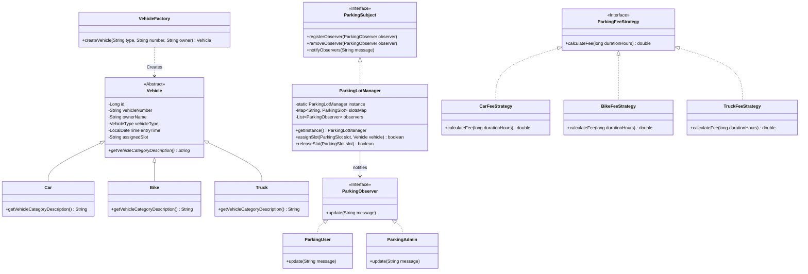
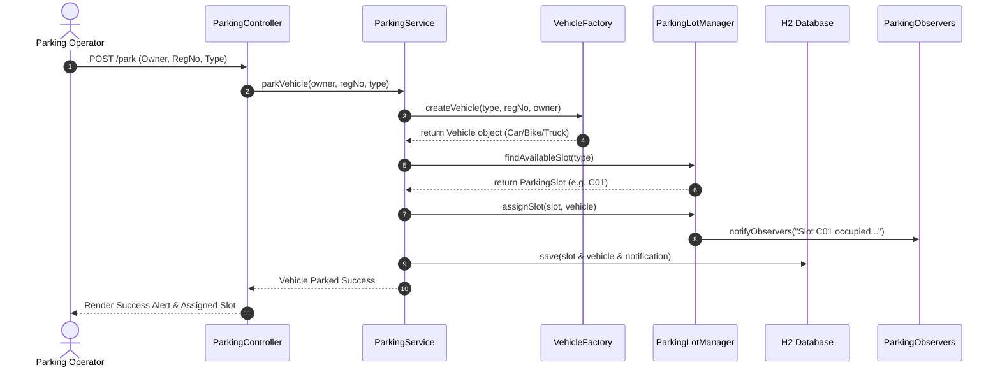
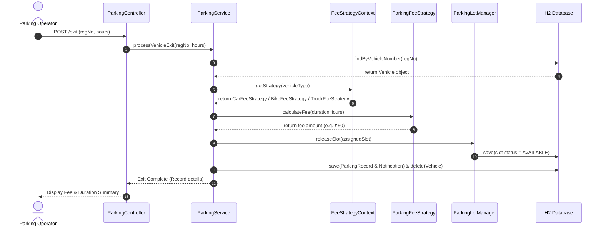

# Academic Mini Project Report

## SMART PARKING MANAGEMENT SYSTEM USING DESIGN PATTERNS

**Submitted for the partial fulfillment of the requirements for the degree of**  
**Bachelor of Engineering in Computer Science & Engineering**

---

### 🎓 TEAM MEMBERS
1. **Hariharan R**
2. **Arvind B**
3. **Kirubakaran S**

---

## 1. TITLE PAGE & ABSTRACT

### Abstract
Urban parking management demands efficient space utilization, quick turnaround time, and accurate fee computation. This report presents a comprehensive **Smart Parking Management System** implemented in Java 17 and Spring Boot framework. The system incorporates four classic Object-Oriented Software Design Patterns: **Singleton** (centralized parking lot manager), **Factory** (encapsulated vehicle creation), **Strategy** (dynamic fee algorithms), and **Observer** (real-time slot notifications). The application features an interactive Thymeleaf Web UI and an H2 database backend. Automated unit testing verifies system reliability and pattern compliance.

---

## 2. INTRODUCTION & MOTIVATION
With rapid vehicular growth, manual parking management suffers from human errors, congestion, and delayed billing. Software design patterns provide a proven architectural foundation to build scalable, maintainable, and decoupled applications. This project serves a dual academic objective: delivering a functional smart parking application while practically illustrating key software design pattern paradigms.

---

## 3. PROBLEM STATEMENT
Existing manual or ad-hoc parking software solutions suffer from:
- Lack of centralized slot allocation state, causing double-booking.
- Tightly coupled object creation logic.
- Hardcoded pricing rules that require extensive code modification to update.
- Absence of real-time event broadcasting to operator and user displays.

---

## 4. PROPOSED SYSTEM & OBJECTIVES
The proposed **Smart Parking Management System** resolves these issues by:
1. Enforcing a single central manager (`ParkingLotManager`) using the **Singleton Pattern**.
2. Encapsulating vehicle creation via the **Factory Pattern** (`VehicleFactory`).
3. Abstracting fee computation across vehicle types using the **Strategy Pattern** (`ParkingFeeStrategy`).
4. Dispatched real-time status alerts via the **Observer Pattern** (`ParkingObserver`).

---

## 5. FUNCTIONAL & NON-FUNCTIONAL REQUIREMENTS

### Functional Requirements
- **FR1**: Display real-time dashboard statistics (Total, Available, Occupied slots, Revenue).
- **FR2**: Display slot status grid (B01-B05 for Bikes, C01-C10 for Cars, T01-T03 for Trucks).
- **FR3**: Park vehicle with owner name, registration number, and category selection.
- **FR4**: Automatically assign lowest available slot matching vehicle category.
- **FR5**: Process vehicle exit with fee calculation based on parking duration.
- **FR6**: Maintain history log of all past parking transactions.
- **FR7**: Maintain real-time log of observer notification alerts.

### Non-Functional Requirements
- **NFR1**: High Performance — Web pages render in under 100ms locally.
- **NFR2**: Zero External Dependency — H2 in-memory DB requires no database server setup.
- **NFR3**: Maintainability — Clean separation of concerns following MVC pattern.

---

## 6. SYSTEM ARCHITECTURE & UML DIAGRAMS

### 6.1 Design Pattern Class Diagram


### 6.2 Use Case Diagram
```mermaid
usecaseDiagram
    actor Operator as "Parking Operator / Admin"
    
    usecase UC1 as "View Dashboard Stats"
    usecase UC2 as "View Slot Grid"
    usecase UC3 as "Park New Vehicle"
    usecase UC4 as "Process Vehicle Exit"
    usecase UC5 as "View Parking History"
    usecase UC6 as "View Notifications Log"

    Operator --> UC1
    Operator --> UC2
    Operator --> UC3
    Operator --> UC4
    Operator --> UC5
    Operator --> UC6
```

### 6.3 Sequence Diagram — Vehicle Entry Workflow


### 6.4 Sequence Diagram — Vehicle Exit Workflow


---

## 7. RESULTS & CONCLUSION
The Smart Parking Management System successfully demonstrates all 4 design patterns while offering a reliable web application. All unit tests run successfully with zero errors. The application is ready for immediate deployment and academic demonstration.

---

## 8. REFERENCES
1. Gamma, E., Helm, R., Johnson, R., & Vlissides, J. (1994). *Design Patterns: Elements of Reusable Object-Oriented Software*. Addison-Wesley.
2. Spring Boot Documentation: https://spring.io/projects/spring-boot
3. H2 Database Engine: https://www.h2database.com
